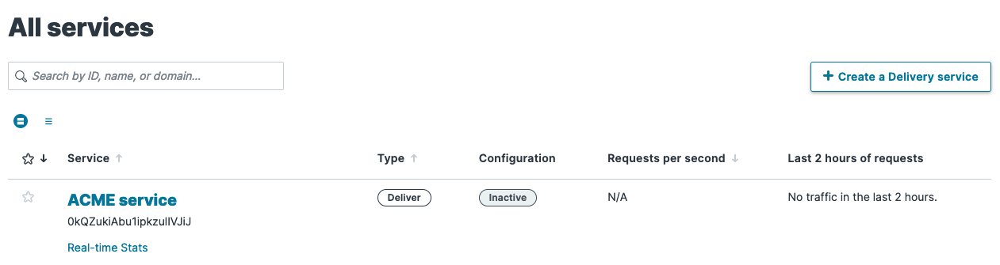
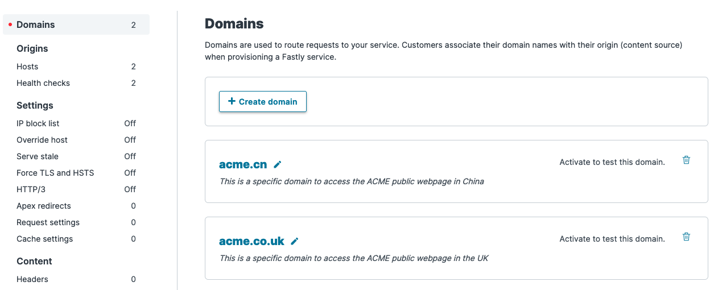
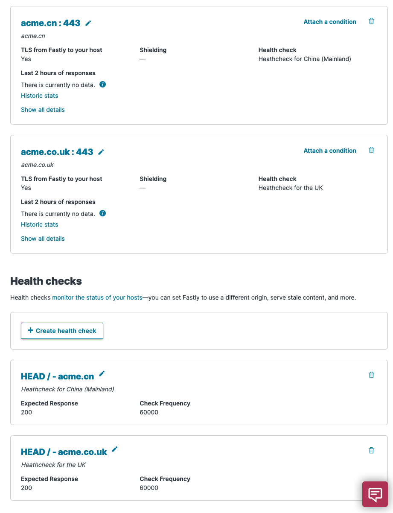

# Set up a new Fastly service

With the Fastly resources for CloudFormation, you can kick a CDN with health-checks for new projects simply, efficiently, and consistently.

Project build pipelines and other project-bootstrap infrastructure can also be included
as part of the CloudFormation, so organizations can have a quick and common way to bootstrap a new project.

This demo will use the following types:
* `Fastly::Services::Service` - to create a new Fastly delivery service.
* `Fastly::Services::Domain` - to attach a domain to a Fastly delivery service.
* `Fastly::Services::Backend` - to attach a host/backend to a Fastly delivery service.
* `Fastly::Services::Healthcheck` - to define a health-check for a Fastly delivery service.

## Delivery service name

Typically in Fastly, you will need to create a delivery service for you CDN. This resource is the starting point
for the others, and only take a name as a required argument. Let's create parameter in our stack to capture this:

```yaml
Parameters:
  DeliveryServiceName:
    Type: String
    Description: Name of the delivery service in Fastly
```

## Other parameter

For the purpose of this example, we are going to define a mapping that will help you setup the other resources

```yaml
Mappings:
  CountryMap:
    UK:
      Domain: acme.co.uk
      BackendName: acme.co.uk
      HealthcheckName: "Heathcheck for the UK"
    China:
      Domain: acme.cn
      BackendName: acme.cn
      HealthcheckName: "Heathcheck for China (Mainland)"
```

## Create a delivery service

We can define our new delivery service as follows:

```yaml
  DeliveryService:
    Type: Fastly::Services::Service
    Properties:
      Name: !Ref DeliveryServiceName
```

_Please note the `Fastly::Services::Service` does offer more properties. [Please check the documentation](../../resources/Fastly-Services-Service)._

## Attach a domain to the delivery service

A domain represents the domain name through which visitors will retrieve content. There can be multiple domains for a delivery service.
In this example, we are going to attach two domain: `acme.co.uk` and `acme.cn`:

```yaml
  UKDomain:
    Type: Fastly::Services::Domain
    Properties:
      Name: !FindInMap [CountryMap, UK, Domain]
      Comment: This is a specific domain to access the ACME public webpage in the UK
      ServiceId: !GetAtt DeliveryService.Id
      VersionId: !GetAtt DeliveryService.LatestVersionId
  ChinaDomain:
    Type: Fastly::Services::Domain
    Properties:
      Name: !FindInMap [CountryMap, China, Domain]
      Comment: This is a specific domain to access the ACME public webpage in China
      ServiceId: !GetAtt DeliveryService.Id
      VersionId: !GetAtt DeliveryService.LatestVersionId
```

## Create health checks

Now we can create health check for these domains. Healthchecks are used to customize the way Fastly checks on your Backends.
If an origin server is marked unhealthy due to health checks, Fastly will stop attempting to send requests to it.
If all origin servers are marked unhealthy, Fastly will attempt to serve stale. If no stale object is available, a 503 will be returned to the client.

```yaml
  UKHealthcheck:
    Type: Fastly::Services::Healthcheck
    Properties:
      ServiceId: !GetAtt DeliveryService.Id
      VersionId: !GetAtt DeliveryService.LatestVersionId
      Name: !FindInMap [CountryMap, UK, HealthcheckName]
      CheckInterval: 60000
      Host: !FindInMap [CountryMap, UK, Domain]
      Initial: 1
      Path: "/"
      Threshold: 1
      Timeout: 5000
      Window: 2
  ChinaHealthcheck:
    Type: Fastly::Services::Healthcheck
    Properties:
      ServiceId: !GetAtt DeliveryService.Id
      VersionId: !GetAtt DeliveryService.LatestVersionId
      Name: !FindInMap [CountryMap, China, HealthcheckName]
      CheckInterval: 60000
      Host: !FindInMap [CountryMap, China, Domain]
      Initial: 1
      Path: "/"
      Threshold: 1
      Timeout: 5000
      Window: 2
```

## Attach backends

Now that we have domains and health checks created, we can tie everything together with backends. A Backend (also sometimes called an origin server)
is a server identified by IP address or hostname, from which Fastly will fetch your content.
There can be multiple backends attached to a service, but each backend is specific to one service.
By default, the first backend added to a service configuration will be used for all requests (provided it meets any conditions attached to it).
If multiple backends are defined for a service, the first one that has no attached conditions,
or whose condition is satisfied for the current request, will be used.

```yaml
  UKBackend:
    Type: Fastly::Services::Backend
    DependsOn: UKHealthcheck
    Properties:
      ServiceId: !GetAtt DeliveryService.Id
      VersionId: !GetAtt DeliveryService.LatestVersionId
      Name: !FindInMap [CountryMap, UK, BackendName]
      Address: !FindInMap [CountryMap, UK, Domain]
      Port: 443
      UseSsl: true
      MinTlsVersion: "1.2"
      Healthcheck: !FindInMap [CountryMap, UK, HealthcheckName]
  ChinaBackend:
    Type: Fastly::Services::Backend
    DependsOn: ChinaHealthcheck
    Properties:
      ServiceId: !GetAtt DeliveryService.Id
      VersionId: !GetAtt DeliveryService.LatestVersionId
      Name: !FindInMap [CountryMap, China, BackendName]
      Address: !FindInMap [CountryMap, China, Domain]
      Port: 443
      UseSsl: true
      MinTlsVersion: "1.2"
      Healthcheck: !FindInMap [CountryMap, China, HealthcheckName]
```

## Conclusion

As a result, we now have one delivery service in fastly


which has 2 domains `acme.co.uk` and `acme.cn` along with to corresponding hosts and health checks





